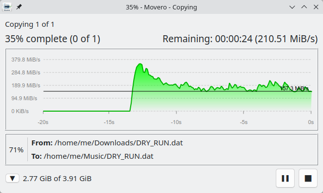
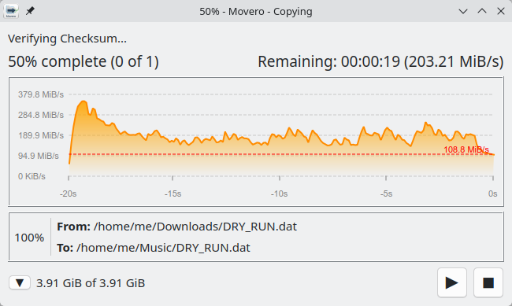
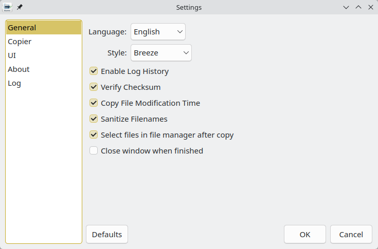

[](https://github.com/silo0074/Movero/blob/main/LICENSE)


## 📖 Table of Contents
* [🚀 Features](#-features)
* [🛠 Advanced Technical Implementation](#-advanced-technical-implementation)
* [📥 Installation](#-installation)
* [⚙️ Configuration & Settings](#️-configuration--settings)
* [🛠️ Build from Source](#️-build-from-source)
* [❤️ Donations](#️-donations)
* [📄 License](#-license)

<br>

# Movero

<p>A customizable file copier that can verify the data integrity using xxHash checksum. It features a graph that displays the speed versus time for an overview of the read/write performance. It is mainly designed for Linux but since it is written in C++ and Qt it can be adapted for Windows if desired.</p>
<p>Since the default file copier in Linux cannot be replaced, the solution is to use a service menu to add a "Paste with Movero" in the right-click menu.</p>
<p>Completed transfers are highlighted in supported file managers using D-Bus.</p>

<br>

## 🚀 Features

- **Hybrid Sync Strategy:** Balances data integrity and speed by batch-flushing data to disk (64MB default) to minimize I/O wait times.
- **Hardware Verification:** Optionally bypasses the Linux Page Cache using `posix_fadvise` and `O_DIRECT` to ensure files are read directly from physical storage during checksum verification.

<br>

| Copying | Paused |
| :---: | :---: |
|  |  |

<details>
<summary><b>Click to see more screenshots</b></summary>

#### Settings


#### Icon

</details>

<br>

## 🛠 Advanced Technical Implementation

It implements several low-level Linux kernel optimizations:

* **Memory Alignment:** Uses `std::aligned_alloc` with 4096-byte boundaries to support `O_DIRECT` I/O.
* **Zero-Cache Verification:** Implements the `fdatasync` + `POSIX_FADV_DONTNEED` sequence to guarantee that verification hashes are calculated from the platter/NAND, not RAM.
* **D-Bus Integration:** Communicates with `org.freedesktop.FileManager1` to highlight completed transfers in your native file manager.

<br>

## 📥 Installation

### Binary Installation (Recommended)
Download the latest `.deb` (Ubuntu/Debian) or `.rpm` (Fedora/openSUSE) from the [Releases](https://github.com/silo0074/Movero/releases) page.

**Make it executable**
```bash
  chmod +x ./Movero-1.0.0-x86_64.rpm
```

**Sha256 Checksums:**
You can verify the integrity of the downloaded binary using this command
```bash
sha256sum ./Movero-1.0.0-x86_64.rpm
```

**Via Terminal (Safest for unsigned packages):**
* **openSUSE:**
```bash
  sudo zypper install --allow-unsigned-rpm ./Movero-1.0.0-x86_64.rpm
```
* **Fedora:**
```bash
  sudo dnf install --allow-unsigned-rpm ./Movero-1.0.0-x86_64.rpm
```
* **Ubuntu/Debian:**
```bash
  sudo apt install ./Movero-1.0.0-x86_64.deb
```

**Note on Installation**: Since these packages are not signed by a central authority, your package manager (YaST/DNF) may warn you about a "Signature verification failed." You can safely proceed by choosing "Ignore" or installing via CLI with the `--allow-unsigned-rpm` (zypper) or `--nogpgcheck` (dnf) flag.

### System Requirements

If you are running a minimal installation, ensure you have the following:
- Qt 6.5+ (Widgets and DBus modules)
- libxxhash
- Linux Kernel 5.1+ (Required for sync_file_range used in hybrid sync)

<br>

## ⚙️ Configuration & Settings

The application Settings can be accessed using the start menu.

### General & UI

- **Language & Style**: Change the application language and interface theme.
- **Log History**: Enable or disable the tracking of transferred files and errors.
- **Sanitize Filenames**: Automatically replaces characters unsupported by the destination file system with Unicode equivalents to prevent transfer failures. Linux supports all characters in the filename except '/' but if you have a Windows file system such as NTFS, you should enable this.
- **Select Files**: Automatically highlights the copied files in your file manager once the process is complete.

### Copier Performance

- **Copy Buffer Size**: Adjustable memory buffer. While it supports up to 1024MB, 8MB is usually optimal for balancing syscall overhead and CPU cache performance.
- **Force Sync Threshold**: Files larger than this value are forced to disk (fdatasync) to ensure physical integrity. High-speed NVMe users can set this lower for maximum safety. When the data is not flushed to disk using fdatasync, the checksum will most likely be compared against the data in RAM which doesn't reflect the integrity of the final data on the disk. When copying a large amount of small files, the speed will decrease if the checksum is enabled and the file size is larger than this threshold.
- **Disk Space Safety Margin**: Set a minimum amount of free space (default 50MB) that must remain on the destination drive before the copy starts.

### Speed Graph

- **History Size**: Control how many seconds of history are visible on the graph.
- **Max Speed (MB/s)**: Set the "floor" for the graph's Y-axis. The graph will dynamically scale upward if your transfer speed exceeds this value.
- **Preview Mode**: "Preview file transfer window" allows you to test the UI and graph behavior without actually writing any data to disk.

<br>

## 🛠️ Build from Source
To compile Movero from source, ensure you have Qt6 (Core, Gui, Widgets, DBus, LinguistTools) and libxxhash installed on your system.

### Prerequisites
OpenSuse/Fedora (for Fedora replace zypper with dnf):
```bash
sudo zypper install CMake gcc-c++ mold lld xxhash-devel \
qt6-base-devel qt6-tools-devel qt6-widgets-devel qt6-linguist-devel
```
Ubuntu:
```bash
sudo apt install cmake g++ mold lld libxxhash-dev \
qt6-base-dev qt6-base-dev-tools qt6-tools-dev
```

### Compile
Linux (Debian/Ubuntu/Fedora)
```bash
# Clone the repository
git clone [https://github.com/silo0074/Movero.git](https://github.com/silo0074/Movero.git)
cd Movero

# Create a build directory
mkdir build && cd build

# Configure and build
cmake ..
make -j$(nproc)

# Install (Optional)
sudo make install
```

### Packaging

You can generate native Linux packages (.deb or .rpm) using CPack:
```bash
# Generate a Debian package
cpack -G DEB

# Generate an RPM package
cpack -G RPM
```

<br>

## 🛠️ Built With

    [C++ 17](https://en.cppreference.com/w/cpp/17) - The core programming language.

    [Qt 6](https://www.qt.io/) - Used for the graphical user interface, D-Bus integration, and cross-platform system logic.

    [xxHash](https://cyan4973.github.io/xxHash/) - Extremely fast non-cryptographic hash algorithm used for checksum verification.

    [CMake](https://cmake.org/) - The build system used for compilation and packaging.

<br>

## ❤️ Donations

<a href="https://www.buymeacoffee.com/liviuistrate" target="_blank">
  
</a>


<br>
<br>


## 📄 License
This project is licensed under the [GPLv3](https://github.com/silo0074/Movero/blob/main/LICENSE) License.
